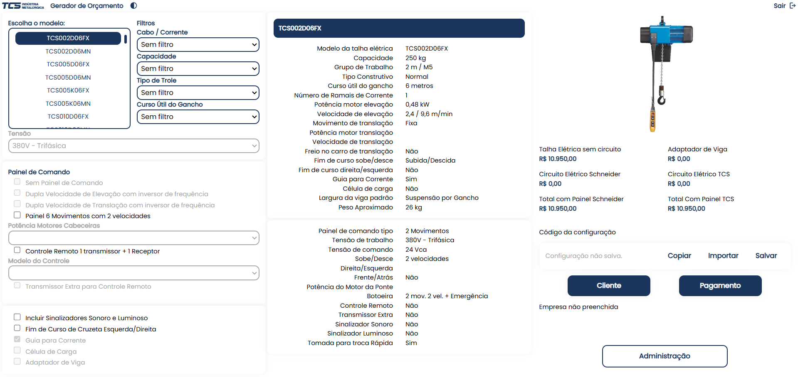
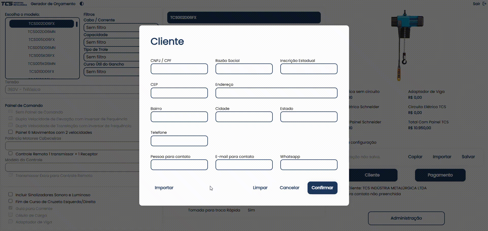
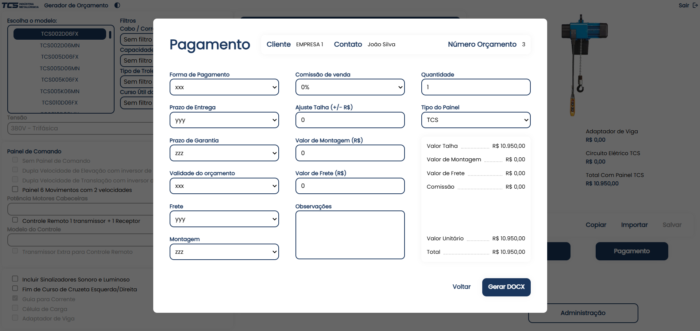
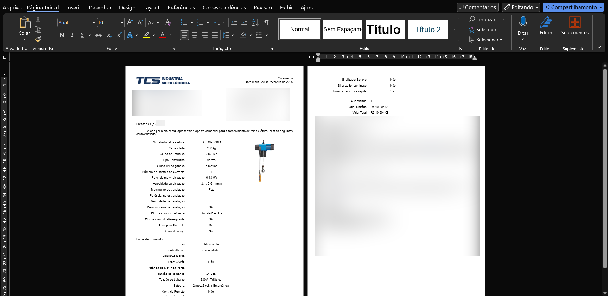

# Gerador de Orçamentos Full-Stack (Java + React)

Aplicação web completa para automatizar a criação de orçamentos técnicos de talhas elétricas, com integração a um ERP (Enterprise Resource Planning) externo via API GraphQL.

## Funcionalidades

### Personalização da Talha Elétrica
A aplicação permite ao usuário alterar componentes da talha conforme as características individuais de cada talha. Além disso, ocorre atualização em tempo real do preço da compra, que é calculado segundo os preços individuais vindos diretamente da ERP.

### Importação de Cliente
A aplicação permite importar dados dos clientes cadastrados na ERP para agilizar a criação de orçamentos.

### Importação de Orçamento
A aplicação permite importar um orçamento salvo na mesma, incluindo a configuração da talha e os dados do cliente.

### Personalização do pagamento
Existe também uma tela que permite alterar as diversas informações sobre a compra.

### Geração de Arquivo Word Docx
A aplicação permite gerar um arquivo editável Docx contendo todos os dados preenchidos.

### Importação de template Docx
A aplicação permite ao usuário carregar seu próprio template docx para eventuais orçamentos personalizados. Também permite o download do modelo padrão para visualizar exemplos de preenchimento do template.

### Modo padrão e administrador
A aplicação conta com duas versões: padrão e administrador. A segunda tem acesso a todas funcionalidades disponíveis, enquanto a primeira apenas a uma fração.

### Gerenciamento de usuários
A aplicação possui telas de registro e listagem de usuários. Na tela de listagem é possível observar o número de acessos e de orçamentos criados.

### Troca de tema
Existem dois temas visuais na aplicação, o claro e o escuro, que podem rapidamente ser alterados

